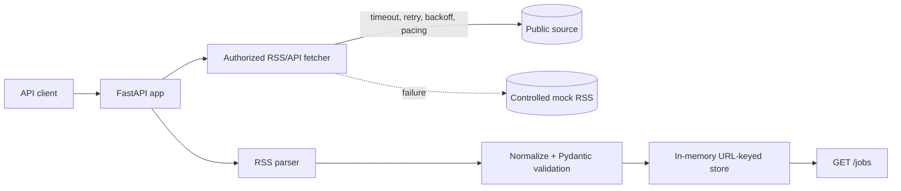

# Architecture

## Diagram

## Detection Surface and Boundaries

This service is an API client for an authorized public RSS/API feed. It does not scrape HTML pages or protected job boards. It does not use browser automation, Selenium, proxies, fingerprint evasion, CAPTCHA solving, authentication workarounds, or robots.txt bypasses.

A protected site can observe request-level signals such as user-agent, headers, cookies, request frequency, status codes, and repeated URL access. Browser automation can additionally expose WebDriver properties, automation flags, unusual JavaScript timing, missing browser APIs, and navigation patterns. Behavioral patterns include high request volume, regular machine-like timing, deep pagination, and repeated retries. IP/network signals include many requests from one address, shared hosting ranges, geographic changes, and connection-level reputation. None of these signals should be bypassed here; the correct response is to use the provider's documented RSS/API or obtain permission.

## Ingestion Strategy

`JOB_FEED_URL` points to an authorized RSS source. The default `mock://local/jobs` source is controlled by this project and makes local demos deterministic. `fetcher.py` uses a 10-second request timeout, up to three retries, and exponential delays of 1, 2, and 4 seconds. A one-second minimum interval provides basic pacing between requests in this single-process service.

If fetching or parsing fails, the mock feed is used and a warning is logged. If an already populated source returns zero items, existing jobs are preserved and a warning is logged. If an empty source is encountered before any jobs exist, the mock feed is used. This avoids silently deleting data because of a temporary outage, source change, or suspicious empty response.

## Validation and Deduplication

The parser extracts RSS fields without assuming a particular protected website schema. The normalizer trims whitespace, decodes HTML entities, supplies readable defaults for missing company and location, and creates a `Job` Pydantic model. Invalid records are logged and skipped. The stable identifier is a SHA-256 hash of the normalized job URL, so the same URL is only stored once.

## Logging and Future Changes

Logs record retries, fallback use, invalid records, empty responses, and ingestion counts. Source-specific mappings should be changed in the parser or a future source adapter, not in the API routes. A full production implementation would add durable storage, source-specific monitoring, metrics, and explicit data-retention rules. It would also use a provider-approved API client when an API is available.

## Ethical and Technical Limits

Only use feeds whose terms and owners authorize this access. Respect published limits, authentication rules, and robots restrictions. Never bypass CAPTCHA, bot detection, IP bans, rate limits, authentication, or other access controls. If no authorized public source is available, keep using the controlled mock feed and document the source contract needed for future integration.
